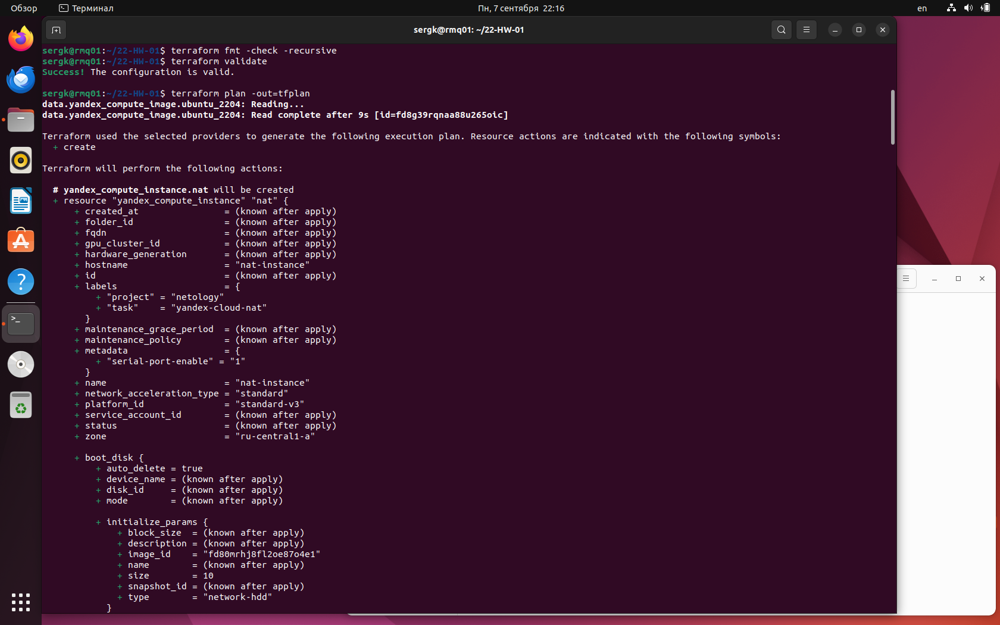
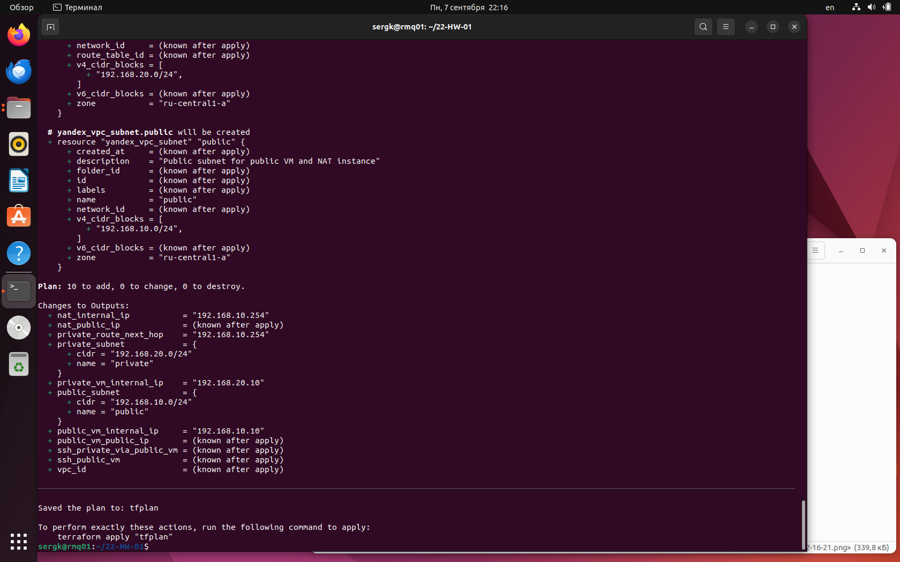
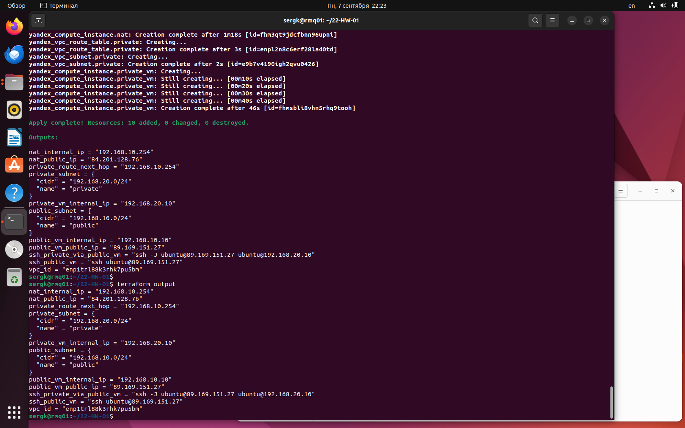
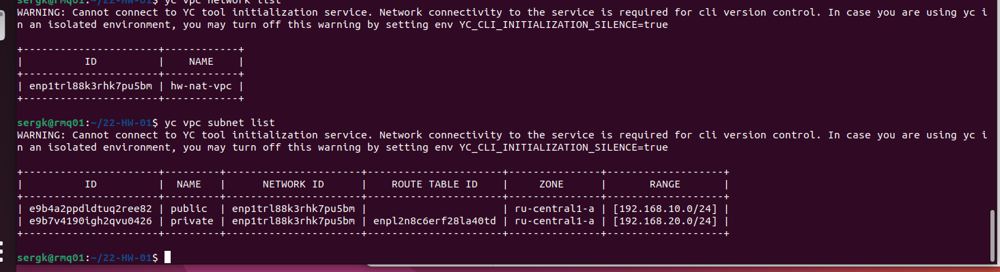
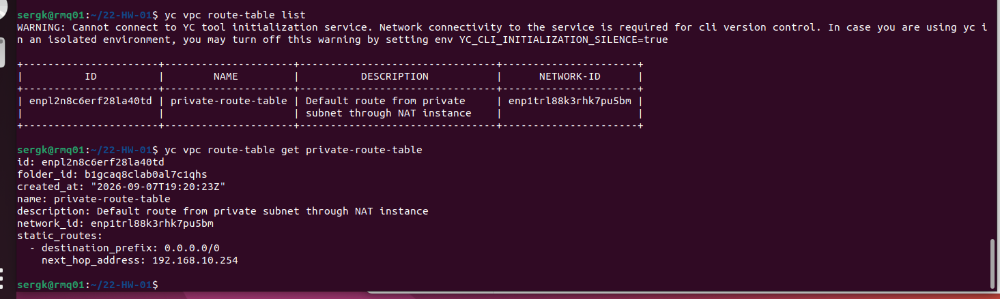
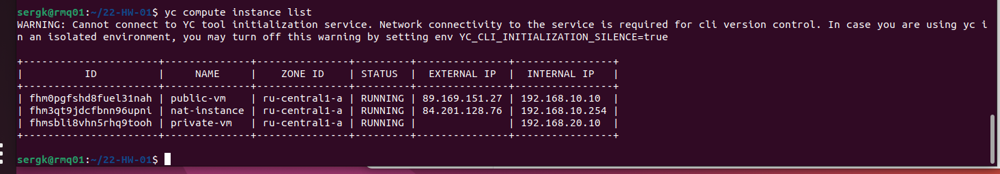
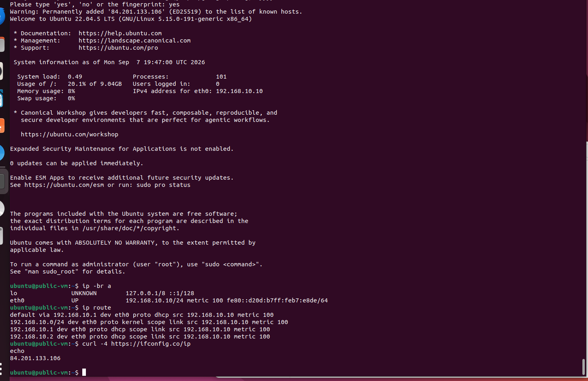
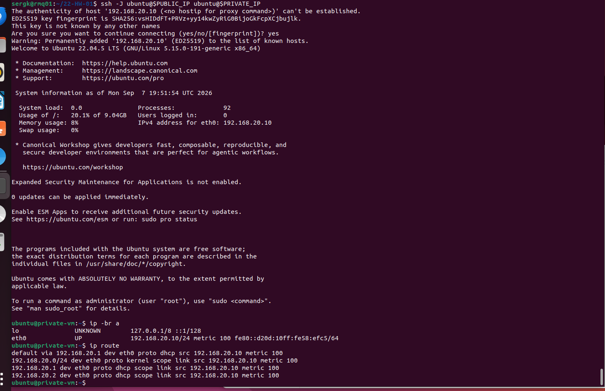
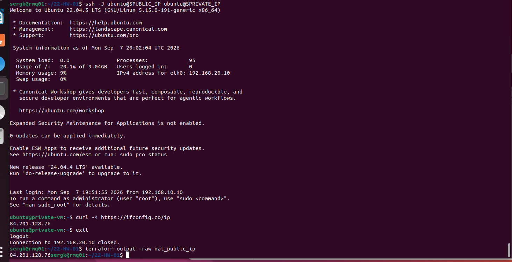
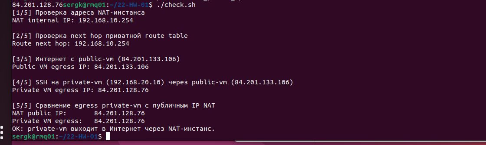

# Домашнее задание к занятию «Организация сети»

## Задание 1. Yandex Cloud — публичная и приватная подсети через NAT-инстанс

Что нужно сделать

1. Создать пустую VPC. Выбрать зону.
2. Публичная подсеть.
- Создать в VPC subnet с названием public, сетью 192.168.10.0/24.
- Создать в этой подсети NAT-инстанс, присвоив ему адрес 192.168.10.254. В качестве image_id использовать fd80mrhj8fl2oe87o4e1.
- Создать в этой публичной подсети виртуалку с публичным IP, подключиться к ней и убедиться, что есть доступ к интернету.
3. Приватная подсеть.
- Создать в VPC subnet с названием private, сетью 192.168.20.0/24.
- Создать route table. Добавить статический маршрут, направляющий весь исходящий трафик private сети в NAT-инстанс.
- Создать в этой приватной подсети виртуалку с внутренним IP, подключиться к ней через виртуалку, созданную ранее, и убедиться, что есть доступ к интернету.


## Решение

## Цель

С помощью Terraform создать законченную инфраструктуру в Yandex Cloud:

- новую пустую VPC;
- публичную подсеть `public` — `192.168.10.0/24`;
- NAT-инстанс в публичной подсети с фиксированным внутренним IP `192.168.10.254` и образом `fd80mrhj8fl2oe87o4e1`;
- публичную Ubuntu VM с публичным IP и доступом в Интернет;
- приватную подсеть `private` — `192.168.20.0/24`;
- route table с маршрутом `0.0.0.0/0 -> 192.168.10.254`;
- приватную Ubuntu VM без публичного IP;
- проверить подключение к private VM через public VM и выход private VM в Интернет через NAT-инстанс.

Рабочая зона: `ru-central1-a`.

---

## Схема инфраструктуры

```text
                           Internet
                              |
                 +------------+-------------+
                 |                          |
          public IP                    public IP
                 |                          |
        +--------v--------+        +--------v--------+
        |    public-vm    |        |   nat-instance  |
        | 192.168.10.10   |        | 192.168.10.254  |
        +--------+--------+        +--------+--------+
                 |                          ^
                 |                          |
                 +--------- public ---------+
                    192.168.10.0/24

                              ^
                              |
                 route 0.0.0.0/0
                 next hop 192.168.10.254
                              |
                    +---------+---------+
                    |      private      |
                    | 192.168.20.0/24   |
                    +---------+---------+
                              |
                    +---------v---------+
                    |    private-vm     |
                    |  192.168.20.10    |
                    |   public IP: нет  |
                    +-------------------+
```

SSH к приватной VM выполняется через `public-vm` как jump host.

---

## Структура проекта

```text
.
├── .gitignore
├── .terraform.lock.hcl
├── README.md
├── check.sh
├── cloud-config.yml
├── env-yc.sh
├── img/
│   └── 
├── instances.tf
├── locals.tf
├── network.tf
├── outputs.tf
├── provider.tf
├── security_groups.tf
├── terraform.tfvars
├── variables.tf
└── versions.tf
```

### Назначение файлов

| Файл | Назначение |
|---|---|
| [`versions.tf`](versions.tf) | Требуемая версия Terraform и Yandex provider |
| [`provider.tf`](provider.tf) | Provider Yandex Cloud; авторизация берётся из `YC_*` |
| [`variables.tf`](variables.tf) | CIDR, IP, image ID, параметры VM |
| [`locals.tf`](locals.tf) | Общие labels и SSH metadata |
| [`network.tf`](network.tf) | VPC, public/private subnet, route table |
| [`security_groups.tf`](security_groups.tf) | Правила доступа к NAT/public/private VM |
| [`instances.tf`](instances.tf) | NAT-инстанс, public VM, private VM |
| [`outputs.tf`](outputs.tf) | IP-адреса и готовые SSH-команды |
| [`terraform.tfvars`](terraform.tfvars) | Публичный SSH-ключ |
| [`cloud-config.yml`](cloud-config.yml) | Установка `curl` на Ubuntu VM |
| [`env-yc.sh`](env-yc.sh) | Получение временного IAM token через `yc` |
| [`check.sh`](check.sh) | Автоматическая проверка задания после `terraform apply` |


---

## Ссылки на Terraform-манифесты

Основные файлы задания можно открыть прямо из README:

- сеть, public/private subnet и route table — [`network.tf`](network.tf);
- NAT-инстанс, public VM и private VM — [`instances.tf`](instances.tf);
- security groups — [`security_groups.tf`](security_groups.tf);
- переменные и обязательные IP/CIDR — [`variables.tf`](variables.tf);
- значения после `terraform apply` — [`outputs.tf`](outputs.tf);
- provider Yandex Cloud — [`provider.tf`](provider.tf);
- версии Terraform/provider — [`versions.tf`](versions.tf);
- SSH-ключ — [`terraform.tfvars`](terraform.tfvars);
- cloud-init для VM — [`cloud-config.yml`](cloud-config.yml);
- получение `YC_TOKEN` из настроенного `yc` — [`env-yc.sh`](env-yc.sh);
- итоговая автоматическая проверка — [`check.sh`](check.sh).


---

# 1. Настройка Yandex Cloud CLI


Первичная настройка:

```bash
yc init
```

Проверить текущий профиль:

```bash
yc config list
```

Зона в Terraform уже установлена как:

```text
ru-central1-a
```

## Получение credentials для Terraform

Файл: [`env-yc.sh`](env-yc.sh).

В проекте есть скрипт:

```bash
source ./env-yc.sh
```

Он выполняет:

```bash
export YC_TOKEN="$(yc iam create-token)"
export YC_CLOUD_ID="$(yc config get cloud-id)"
export YC_FOLDER_ID="$(yc config get folder-id)"
```

---

# 2. SSH-ключ

Связанные файлы: [`terraform.tfvars`](terraform.tfvars), [`locals.tf`](locals.tf).

```bash
ls -l ~/.ssh/id_ed25519 ~/.ssh/id_ed25519.pub
cat ~/.ssh/id_ed25519.pub
```

В `terraform.tfvars` записан публичный ключ, использовавшийся ранее в предыдущих дз.


---

# 3. Инициализация Terraform

Из каталога проекта:

```bash
terraform init
```

Проверить форматирование:

```bash
terraform fmt -recursive
terraform fmt -check -recursive
```

Проверить конфигурацию:

```bash
terraform validate
```

Создать план:

```bash
terraform plan -out=tfplan
```

В плане должны присутствовать как минимум:

- `yandex_vpc_network.main`;
- `yandex_vpc_subnet.public`;
- `yandex_vpc_subnet.private`;
- `yandex_vpc_route_table.private`;
- `yandex_compute_instance.nat`;
- `yandex_compute_instance.public_vm`;
- `yandex_compute_instance.private_vm`;
- security groups.

Манифесты, которые формируют этот план: [`network.tf`](network.tf), [`security_groups.tf`](security_groups.tf), [`instances.tf`](instances.tf).

**Скриншот 1 — успешный `terraform plan`:**





---

# 4. Создание инфраструктуры

Применить сохранённый план:

```bash
terraform apply tfplan
```

После завершения:

```bash
terraform output
```


Выводы описаны в [`outputs.tf`](outputs.tf).

**Скриншот 2 — успешный `terraform apply` и `terraform output`:**




---

# 5. Проверка ресурсов через Yandex CLI

Основной сетевой манифест: [`network.tf`](network.tf).

Проверить сеть:

```bash
yc vpc network list
```

Проверить подсети:

```bash
yc vpc subnet list
```

В выводе:

```text
public   192.168.10.0/24
private  192.168.20.0/24
```

**Скриншот 3 — созданные VPC/subnet:**




Проверить таблицу маршрутизации:

```bash
yc vpc route-table list
```

Получить подробности:

```bash
yc vpc route-table get private-route-table
```

В маршруте:

```text
destination_prefix: 0.0.0.0/0
next_hop_address: 192.168.10.254
```

Route table создаётся в [`network.tf`](network.tf).

**Скриншот 4 — маршрут private subnet через NAT-инстанс:**




Проверить VM:

```bash
yc compute instance list
```

```text
nat-instance
public-vm
private-vm
```

У `private-vm` не должно быть публичного IPv4.

VM создаются в [`instances.tf`](instances.tf), а правила доступа — в [`security_groups.tf`](security_groups.tf).

**Скриншот 5 — список VM:**



На скриншоте `nat-instance`, `public-vm`, `private-vm` и отсутствие публичного IP у `private-vm`.


---

# 6. Проверка public VM

Получить публичный IP:

```bash
PUBLIC_IP=$(terraform output -raw public_vm_public_ip)
echo "$PUBLIC_IP"
```

Подключиться:

```bash
ssh ubuntu@$PUBLIC_IP
```

На VM проверить адреса и маршруты:

```bash
ip -br a
ip route
```

Проверить Интернет:

```bash
curl -4 https://ifconfig.co/ip
echo
```

Команда показывает внешний IPv4 публичной VM.

**Скриншот 6 — подключение к public VM и доступ в Интернет:**




---

# 7. Подключение к private VM через public VM

Получить адреса:

```bash
PUBLIC_IP=$(terraform output -raw public_vm_public_ip)
PRIVATE_IP=$(terraform output -raw private_vm_internal_ip)
```

### Вариант ProxyJump 

Подключиться с локальной машины через jump host:

```bash
ssh -J ubuntu@$PUBLIC_IP ubuntu@$PRIVATE_IP
```

```bash
ip -br a
```

Проверить маршрут:

```bash
ip route
```

Это соответствует требованию «подключиться к приватной VM через виртуалку, созданную ранее»: первым SSH-узлом является `public-vm`, после чего SSH перенаправляет соединение на `private-vm`. При этом приватный SSH-ключ не копируется на публичную VM.

**Скриншот 7 — вход на private VM через public VM:**




Проверить Интернет:

```bash
curl -4 https://ifconfig.co/ip
echo
```

Полученный внешний IP должен совпасть с публичным IP NAT-инстанса. Выйходим из `private-vm`:

```bash
exit
```

И уже **на локальной машине**, в каталоге Terraform-проекта:

```bash
terraform output -raw nat_public_ip
```

Если IP совпадают, private VM выходит в Интернет через `nat-instance`.

**Скриншот 8 — private VM имеет Интернет через NAT-инстанс:**



На скриншоте  `curl -4 https://ifconfig.co/ip` на `private-vm` и значение `terraform output -raw nat_public_ip` на локальной машине. Эти адреса совпадают.


---

# 8. Автоматическая проверка

Скрипт: [`check.sh`](check.sh).

После `terraform apply` можно выполнить:

```bash
./check.sh
```

Скрипт проверяет:

1. NAT имеет внутренний IP `192.168.10.254`.
2. `private-route-table` указывает на NAT.
3. `public-vm` имеет Интернет.
4. SSH к `private-vm` работает через `public-vm`.
5. Внешний IP `private-vm` совпадает с публичным IP NAT-инстанса.

Если приватный SSH-ключ находится не в `~/.ssh/id_ed25519`:

```bash
SSH_KEY=~/.ssh/<имя_ключа> ./check.sh
```

**Дополнительный финальный скриншот — полный успешный `check.sh`:**



---

# 9. Что именно реализовано в Terraform

Ниже приведены ключевые фрагменты. Полные манифесты доступны по ссылкам рядом с каждым ресурсом.

## VPC

Манифест: [`network.tf`](network.tf).

```hcl
resource "yandex_vpc_network" "main" {
  name = var.network_name
}
```

Создаётся отдельная сеть, а не используется существующая `default`.

## Public subnet

Манифест: [`network.tf`](network.tf).

```hcl
resource "yandex_vpc_subnet" "public" {
  name           = "public"
  v4_cidr_blocks = ["192.168.10.0/24"]
}
```

## NAT-инстанс

Манифест: [`instances.tf`](instances.tf).

Ключевые параметры:

```hcl
image_id   = "fd80mrhj8fl2oe87o4e1"
ip_address = "192.168.10.254"
nat        = true
```

`nat = true` выдаёт NAT-инстансу внешний IPv4, через который он может выпускать трафик private-сети в Интернет.

## Private route table

Манифест: [`network.tf`](network.tf).

```hcl
static_route {
  destination_prefix = "0.0.0.0/0"
  next_hop_address   = yandex_compute_instance.nat.network_interface[0].ip_address
}
```

То есть любой адрес, не относящийся к локальной VPC, направляется на `192.168.10.254`.

## Private subnet

Манифест: [`network.tf`](network.tf).

К подсети привязана route table:

```hcl
route_table_id = yandex_vpc_route_table.private.id
```

## Private VM

Манифест: [`instances.tf`](instances.tf).

У private VM:

```hcl
nat = false
```

Поэтому собственного публичного IP у неё нет. Интернет она получает только благодаря маршруту через NAT-инстанс.

---

# 11. Удаление инфраструктуры


```bash
terraform destroy
```

После удаления проверить:

```bash
yc compute instance list
yc vpc network list
```

---
